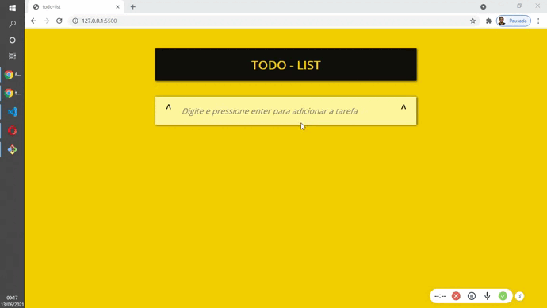

# ListaTarefas
Projeto pequeno de Todo List em Javascript puro, 
<h1>Todo List</h1> 

<p align="center">
  
  
  
   
</p>

> Status do Projeto: :heavy_check_mark: :warning: (concluido, em desenvolvimento, etc)

### Tópicos 

:small_blue_diamond: [Descrição do projeto](#descrição-do-projeto)

:small_blue_diamond: [Funcionalidades](#funcionalidades)

:small_blue_diamond: [Deploy da Aplicação](#deploy-da-aplicação-dash)

:small_blue_diamond: [Pré-requisitos](#pré-requisitos)

:small_blue_diamond: [Como rodar a aplicação](#como-rodar-a-aplicação-arrow_forward)

... 

Insira os tópicos do README em links para facilitar a navegação do leitor

## Descrição do projeto 

<p align="justify">
  Simples TODOLIST com todas as funcionalidades que precisa para Criar, Marcar e Desmarcar e Excluir
</p>

## Funcionalidades

:heavy_check_mark: Criar Tarefa 

:heavy_check_mark: Marca tarefa como concluída

:heavy_check_mark: Desmarca tarefa

:heavy_check_mark: Excluir tarefa 

## Layout ou Deploy da Aplicação :dash:

> 

... 

## Pré-requisitos

:warning: [Node](https://nodejs.org/en/download/)

...

Liste todas as dependencias e libs que o usuário deve ter instalado na máquina antes de rodar a aplicação 

## Como rodar a aplicação :arrow_forward:

Apenas dois cliques na index.html

No terminal, clone o projeto: 

```
git clone https://https://github.com/AbiltonDias/ListaTarefas
```

... 

## JSON :floppy_disk:

### Usuários: 

|name|email|token|avatar|
| -------- |-------- |-------- |-------- |-------- |
|Abilton Dias|abiltongd@gmail.com|true|https://avatars.githubusercontent.com/u/14594735?s=60&v=4

... 

## Linguagens utilizadas :books:

- [Javascript](https://developer.mozilla.org/en-US/docs/Web/JavaScript)


...


## Tarefas em aberto

Se for o caso, liste tarefas/funcionalidades que ainda precisam ser implementadas na sua aplicação

:memo: Novas Funcionalidades

:memo: Alteração no Layout
 

## Desenvolvedores/Contribuintes :octocat:

Liste o time responsável pelo desenvolvimento do projeto

| [<br><sub>Abilton Das</sub>](https://github.com/AbiltonDias) | | :---: | :---: | :---: 

## Licença 

The [MIT License]() (MIT)

Copyright :copyright: 2021 - Todo List
